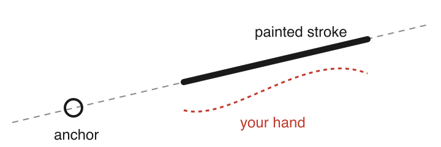

# Rebels Rule

A ruler for [Krita](https://krita.org) that keeps your brush. Tap to set an
anchor, move the pointer away and paint toward it: the stroke stays on the
straight line between where you started and the anchor, with pressure, tilt
and texture intact. Inspired by the excellent ruler tool in Rebelle.



## Use it

1. Press **Ctrl+Alt+R** (or **Tools ▸ Scripts ▸ Rebels Rule**) to turn the ruler on.
2. **Tap** the canvas to set an anchor. Tap again to move it.
3. **Move away and paint toward the anchor.** Each stroke gets its own straight line to the same anchor.

**Esc** clears the anchor. Strokes with Ctrl, Shift, Alt or Space held behave
normally, so colour picking, brush resizing and panning still work.

## Install

1. Download `rebelsrule.zip` from the [latest release](https://github.com/chrleon/kritaplugins/releases/latest).
2. In Krita, choose **Tools ▸ Scripts ▸ Import Python Plugin from File…** and pick the zip.
3. Restart Krita, tick **Rebels Rule** in **Settings ▸ Configure Krita ▸ Python Plugin Manager**, and restart once more.

Tested with Krita 5.3 on macOS.

## Develop

```bash
./build.sh            # link plugins into Krita, with hot reload on save
./build.sh --copy     # install a plain copy, no dev tools
./build.sh --zip      # build release zips in dist/
```

Linked plugins reload when you save a `.py` file, and get a
**Reload Rebels Rule** action (Ctrl+Alt+Shift+R). The plugin's manual is
generated from `Manual.src.html`.

---

Designed by a human, built by a machine.
