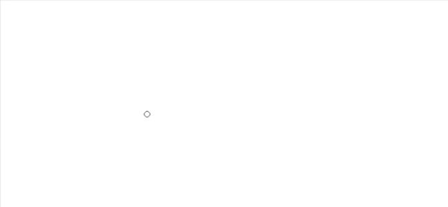

# Rebels Rule

A ruler for [Krita](https://krita.org) that keeps your brush. Tap to set an
anchor, move the pointer away and paint toward it: the stroke stays on the
straight line between where you started and the anchor, with pressure, tilt
and texture intact. Inspired by the excellent ruler tool in [Rebelle](https://www.escapemotions.com/products/rebelle/about).



## Use it

1. Press **Ctrl+Alt+R** (or **Tools ▸ Scripts ▸ Rebels Rule**) to turn the ruler on.
2. **Tap** the canvas to set an anchor. Tap again to move it.
3. **Move away and paint toward the anchor.** Each stroke gets its own straight line to the same anchor.

**Esc** clears the anchor. Strokes with Ctrl, Shift, Alt or Space held behave
normally, so colour picking, brush resizing and panning still work.

## Install

> ### Mac users? Download the zip file.
>
> 1. Download [`rebelsrule.zip`](https://github.com/chrleon/rebelsrule/releases/latest/download/rebelsrule.zip).
> 2. In Krita, choose **Tools ▸ Scripts ▸ Import Python Plugin from File…** and pick the zip.
> 3. When Krita asks **Enable plugins now?**, choose **Yes**.
>    - If you chose **No**, open **Settings ▸ Configure Krita ▸ Python Plugin Manager**, tick **Rebels Rule** and restart Krita.
> 4. Restart Krita, then press **Ctrl+Alt+R** to turn the ruler on.
>
> Why not Import from Web? In Krita 5.3 on macOS it fails with a certificate
> error for every plugin: Krita's built-in Python looks for its list of
> trusted certificates in a folder that only exists on the machine Krita was
> built on.

### Windows and Linux

1. In Krita, choose **Tools ▸ Scripts ▸ Import Python Plugin from Web…** and paste this address:

   ```
   https://github.com/chrleon/rebelsrule/releases/latest/download/rebelsrule.zip
   ```

   Or download `rebelsrule.zip` from the [latest release](https://github.com/chrleon/rebelsrule/releases/latest) and choose **Import Python Plugin from File…** instead.
2. When Krita asks **Enable plugins now?**, choose **Yes**.
   - If you chose **No**, open **Settings ▸ Configure Krita ▸ Python Plugin Manager**, tick **Rebels Rule** and restart Krita.
3. Restart Krita, then press **Ctrl+Alt+R** to turn the ruler on.

Tested with Krita 5.3 on macOS.

## Uninstall

1. In Krita, go to **Settings ▸ Manage Resources…** and click **Open Resource Folder**.
2. Quit Krita.
3. In the folder that opened, delete `pykrita/rebelsrule`, `pykrita/rebelsrule.desktop` and `actions/rebelsrule.action`.

Krita's Python Plugin Manager can only turn plugins off, so removing these files is how you uninstall one.

## Develop

```bash
./build.sh              # link plugins into Krita, with hot reload on save
./build.sh --copy       # install a plain copy, no dev tools
./build.sh --zip        # build release zips in dist/
./build.sh --uninstall  # remove the plugin from Krita, e.g. before testing a zip import
```

Linked plugins reload when you save a `.py` file, and get a
**Reload Rebels Rule** action (Ctrl+Alt+Shift+R). The plugin's manual is
generated from `Manual.src.html`.

---

Designed by a [human](https://christianleon.com), built by a machine.
